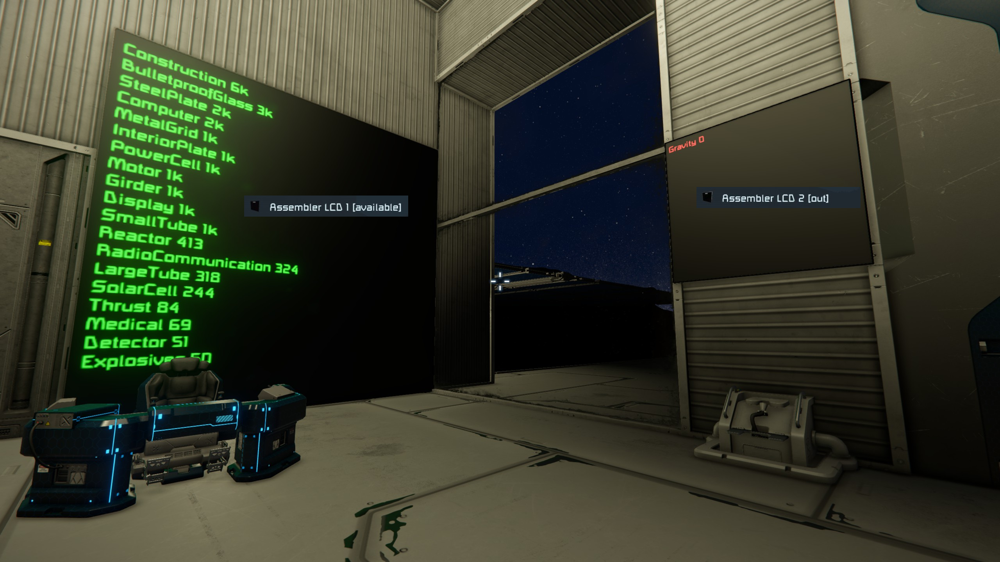

# SE_ContainerInventory

Script for the game Space Engineers.

## Introduction
Have you ever asked yourself how to monitor your storage containers?
 
Then this script is for you.

## Use cases

1. Container inventory monitoring for a ship assembling hangar to monitor how many items are left. Empty items are getting switched over to the "out of stock" lcd panel.

2. Mining ship that has to be monitored 'cause of the resulting weight from the loaded ores.

3. Repair ship to monitor how many is left and what to reload from the base.

## How to use

### Available items

For displaying all available items in one grid name a lcd panel with an added [available]
 
E. g. LCD panel -> LCD panel [available]

### Unvailable items

For displaying all item that are unvailable anymore name a lcd panel with the suffix [out]
 
E. g. LCD panel -> LCD panel [out]

## Monitored items

| Item | Display name |
| ----------- | ----------- |
| BulletproofGlass | Bulletproof Glass |
| Computer | Computer |
| Construction | Construction |
| Detector | Detector |
| Display | Display |
| Explosives | Explosives |
| Girder | Girder |
| Gravity | Gravity |
| InteriorPlate | Interior Plate |
| Medical | Medical |
| MetalGrid | Metal Grid |
| Motor | Motor |
| PowerCell | Power Cell |
| RadioCommunication | Radio Communication |
| Reactor | Reactor |
| SolarCell | Solar Cell |
| SteelPlate | Steel Plate |
| LargeTube | Large Tube |
| SmallTube | Small Tube |
| Thrust | Thruster |
| Superconductor | Super Conductor |
